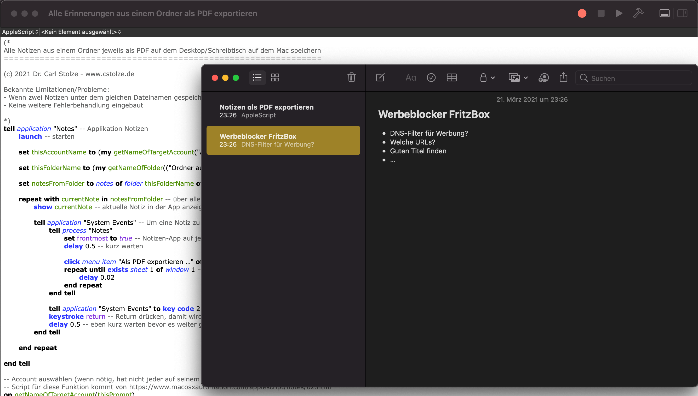
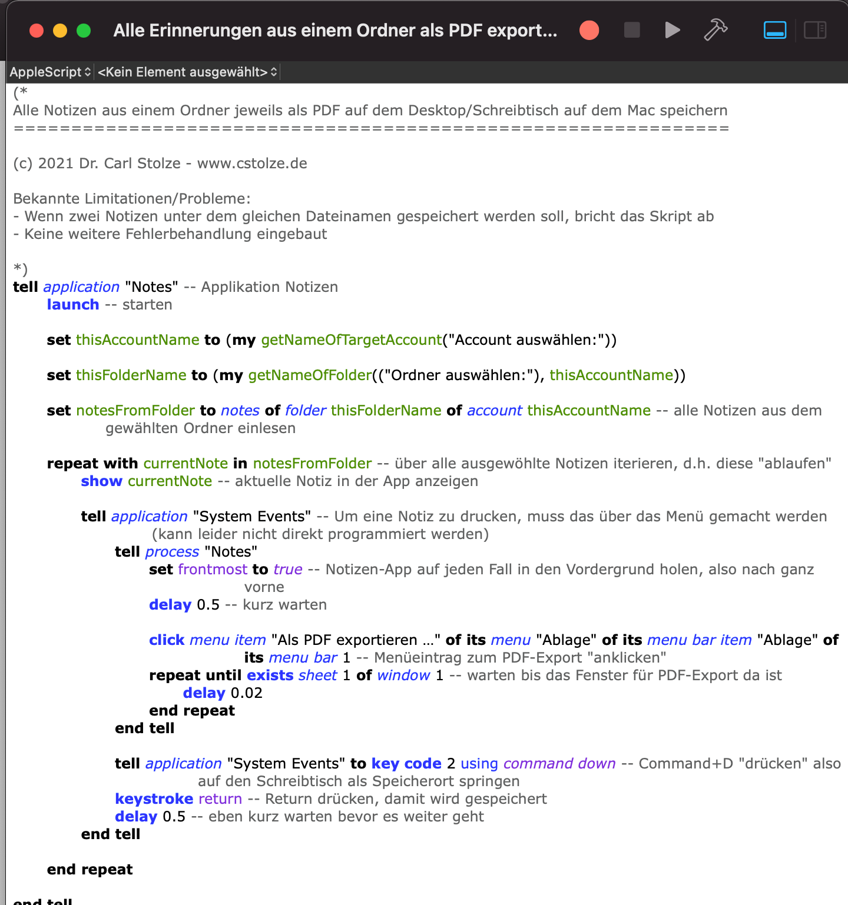

# Notizen auf dem Mac automatisieren: Notes einzeln als PDF speichern

Das Apple Script dient als gutes Beispiel für die mögliche Automatisierung (ohne Automator oder andere Werkzeuge). Es kann auf einem Mac mit dem Script Editor (wird mitgeliefert mit macOS) direkt nach dem Download geöffnet und ausgeführt werden. Entwickelt und getestet habe ich mit macOS Big Sur. 

## Kurzfassung

Download: https://github.com/Tabellendoktor/AppleScript-Notes-export-as-PDF/raw/main/Alle%20Erinnerungen%20aus%20einem%20Ordner%20als%20PDF%20exportieren.scpt

Bekannte Limitationen/Probleme:
- Wenn zwei Notizen unter dem gleichen Dateinamen gespeichert werden soll, bricht das Skript ab
- Keine weitere Fehlerbehandlung eingebaut

Auch wenn dabei bei mir keine weiteren Probleme aufgetaucht sind: **Nutzung auf eigenes Risiko.**

## Die lange Fassung

Für schnelle **Notizen**, **Journaling** und regelmäßiges **Aufschreiben von Gedanken **nutze ich die **Notizen App **(Notes.app) ****von Apple auf Mac und iPhone.

Jetzt wollte ich **mehrere Notizen als PDF speichern**. Leider gibt es immer nur die Option eine Notiz zu exportieren (oder auch zu drucken). Also dann müsste alles **von Hand Notiz für Notiz** **exportiert** werden**?** Das **fand ich nicht sehr erquickend** für über 100 Notizen.

Dabei ist die **Idee** **für** **die** Notizen folgende **Automatisierung**:

 1. **Applikation** Notizen/Notes **starten**

 2. **Bestimmen** aus welchem **Account** etwas exportiert werden soll

 3. **Abfragen** **aus** **welchem Ordner** die Notizen exportiert werden sollen

 4. **Jede Notiz als PDF auf** den **Desktop exportieren**. Der Dateiname ist dabei jeweils die Überschrift der Notiz

Leider gibt es über *Automator* auf dem Mac oder *Kurzbefehle (Shortcuts)* auf dem iPhone **keine direkte Möglichkeit** einen entsprechenden **Ablauf zu bauen**. Was ist dann **die Lösung?** Ein **Klassiker der Automatisierung** auf dem **Mac: AppleScript**. Mit Hilfe des Skripteditor (Script Editor) können direkt diese Automatisierungen geschrieben, getestet und verwaltet werden.

**AppleScript** ist mit Englischkenntnissen grundsätzlich gut nachvollziehbar, aber leider ist die Dokumentation von Apple eher “ausbaufähig” für den einfachen Nutzenden. Mit etwas Hilfe (und Inspiration) sieht das dann im Ergebnis als fertiges Script so aus:

Das komplette fertige Script hier auf GitHub herunterladen: [https://github.com/Tabellendoktor/AppleScript-Notes-export-as-PDF/raw/main/Alle%20Erinnerungen%20aus%20einem%20Ordner%20als%20PDF%20exportieren.scpt](https://github.com/Tabellendoktor/AppleScript-Notes-export-as-PDF/raw/main/Alle%20Erinnerungen%20aus%20einem%20Ordner%20als%20PDF%20exportieren.scpt)

#Mac
